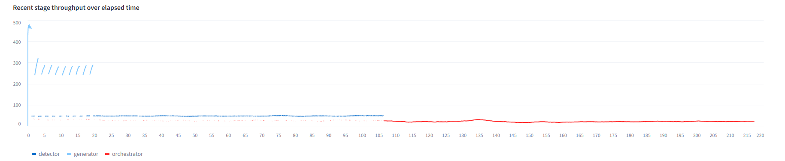
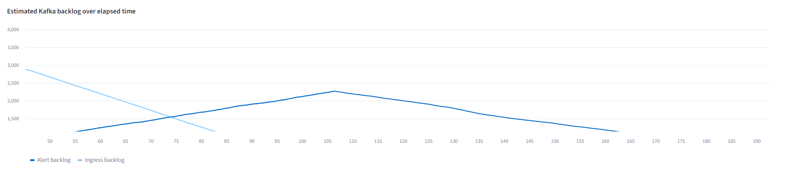
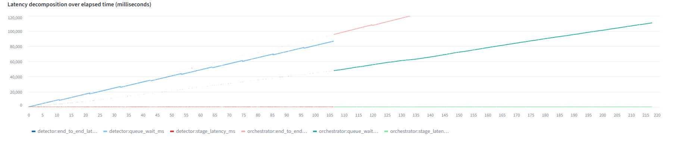

# Lab 2b: High-Load Cybersecurity Pipeline Analysis

This repository contains the results and analysis for **Laboratory 2b: High-Load Cybersecurity with Morpheus Lite**. The lab focuses on evaluating pipeline survivability, throughput capacity, and latency under various load profiles using the Morpheus Lite telemetry and orchestration platform.

## Experimental Measurements

The following table summarizes the key performance metrics collected across all five experimental profiles:

| Profile | Generated / Detected / Orchestrated | Gen EPS | Det Queue Wait (ms) | Orch Queue Wait (ms) | E2E Latency (ms) | System Status |
| :--- | :--- | :--- | :--- | :--- | :--- | :--- |
| **Baseline** | 120 / 120 / 120 | 1.0 | 4.2 | 3.0 | 58.6 | Normal |
| **Normal** | 500 / 500 / 500 | 25.9 | 2.3 | 11.7 | 60.3 | Normal |
| **Burst** | 2000 / 2000 / 2000 | 157.1 | 10,361.6 | 10,111.5 | 20,546.8 | High Load |
| **Sustained** | 5000 / 5000 / 5000 | 249.9 | 42,938.7 | 24,251.4 | 67,245.2 | Overloaded |
| **Attack Surge** | 5000 / 5000 / 5000 | 289.3 | 43,558.9 | 48,296.1 | 92,047.8 | Overloaded |

## Bottleneck Analysis

*   **Baseline & Normal:** The pipeline operates within its design capacity. Throughput is aligned, and queues remain negligible.
*   **Burst:** The **Detector** stage saturates due to a spike in ingress rates. While the generator hits 157 EPS, the detector remains limited to ~47 EPS, causing temporary queue growth.
*   **Sustained:** The **Detector** acts as a hard bottleneck. Persistent backlogs form as the ingress rate (250 EPS) consistently exceeds the processing capacity, leading to severe latency accumulation.
*   **Attack Surge:** Both the **Detector** and **Orchestrator** show signs of saturation. The higher probability of suspicious events forces more data into the computationally expensive orchestration and XAI stages, significantly increasing Orchestrator processing latency and queue wait compared to the sustained profile.

## Pipeline Visualizations

## Reflection

In this laboratory, we investigated the resilience of a cybersecurity pipeline under stress. The experiments demonstrate that saturation is not merely a product of total CPU utilization, but rather a function of architectural throughput limits, such as message serialization and consumer group bottlenecks. 

The primary finding is that **queue wait time** is the dominant factor in system latency. In overloaded states (Sustained and Attack Surge), processing time remains relatively flat, while queue wait times balloon to tens of seconds, accounting for over 99% of end-to-end latency. This highlights the dangers of unbounded queues in security monitoring systems; an alert delayed by 90 seconds is effectively useless for real-time incident response.

The "Attack Surge" profile provided a critical insight: total event count is not the only driver of load. The *quality* of the events—specifically, the probability of triggers that force deeper analysis (like XAI workflows)—can disproportionately stress downstream stages. This confirms why early filtering is essential. However, such filtering must be balanced against security risk; overly aggressive filtering risks missing low-and-slow attacks.

Consequently, graceful degradation is preferable to attempting full analysis of every event. When a system reaches saturation, it is better to employ adaptive sampling or prioritize high-risk traffic than to let the pipeline fail entirely, which creates a blind spot where zero events are processed. For future implementations, monitoring consumer lag and queue depth should be the standard triggers for automated backpressure, as these provide the earliest indication of impending system collapse.

## Submission Files
- [Attack Surge Metrics](lab2b_attack_surge_0e4272c8_metrics.csv)
- [Baseline Metrics](lab2b_baseline_1487d410_metrics.csv)
- [Burst Metrics](lab2b_burst_3f846a89_metrics.csv)
- [Normal Metrics](lab2b_normal_f398aa60_metrics.csv)
- [Sustained Metrics](lab2b_sustained_dafa87ff_metrics.csv)
