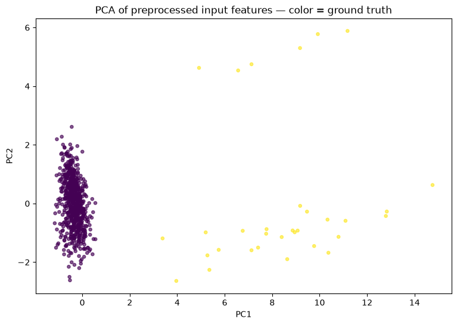
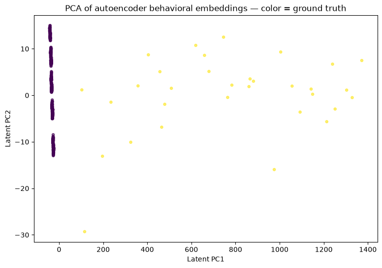

# Lab 2 — Advanced Anomaly Detection for Cybersecurity Logs

**Student Name:** Shachar Laria  
**Student ID:** 214399198  
**Date:** 20/07/2026  

---

## 1. Exploratory Data Analysis (EDA) & Dataset Summary

### Dataset Properties
* **Dimensions:** The ingested dataset contains a total of $3,960$ network log records.
* **Class Balance:** The dataset features a heavy class imbalance deliberately designed to mirror production environments:
  * **Normal Logs:** $3,800$ samples (~96%) representing authorized, baseline user activities.
  * **Attack Logs:** $160$ samples (~4%) acting as the malicious outlier minority.

### Feature Decomposition
The feature engineering pipeline maps two primary vectors:
1. **Categorical Vectors:** `user`, `country`, `device`, and `protocol`. These represent the identity and environmental context of the connection.
2. **Numerical Vectors:** `hour` (temporal feature), `failed_attempts`, `distance_km`, `session_minutes`, and `bytes_out_mb` (behavioral features).

### Expected Baseline vs. Anomaly Profiles
* **Normal Behavior:** Characterized by centralized, routine traffic patterns. The majority of actions occur from standard developer or analyst workstations, originating from domestic geolocations (`IL`), during normal working hours, with zero or near-zero failed authentication attempts.
* **Malicious Profiles:** Volumetric anomalies present heavy right-skewed distributions in features like `failed_attempts` (indicative of active automated attacks) or extreme geodistance gaps (`distance_km`), indicating impossible travel or foreign credential abuse.

---

## 5. Quantitative Model Comparison

### Deep Metrics Analysis
Following model training and evaluation cycles on the test partition, the exact statistical breakdown is structured as follows:

| Evaluation Measure | Model A: Isolation Forest | Model B: Autoencoder + Embeddings |
| :--- | :---: | :---: |
| **Detected Anomalies** | 33 | 39 |
| **Precision** | **0.970** | 0.821 |
| **Recall** | **1.000** | **1.000** |
| **F1 Score** | **0.985** | 0.901 |
| **False Positives (False Alarms)** | **1** | 7 |
| **False Negatives (Misses)** | **0** | 0 |

### In-Depth Disagreement & Behavior Analysis
* **Statistical Agreement:** The models achieved a strong baseline agreement rate of **$99.24\%$**, successfully reaching a consensus on $33$ critical anomaly vectors. Both models demonstrated absolute robustness in coverage, achieving a **$1.000$ Recall score** by catching all $160$ attack vectors across the splits.
* **Architectural Disagreements:** 
  * **Isolation Forest** proved highly effective at segmenting explicit, geometric point-outliers. Because the simulated attacks generated distinct volumetric spikes, the boundary trees isolated them almost immediately, yielding an exceptional Precision of **$0.970$** with only **$1$ false alarm**.
  * **Autoencoder + Embeddings** was slightly over-sensitive, producing **$7$ False Positives**. This behavior stems from the model's architecture. The Autoencoder compresses relationships between categorical values (e.g., mapping which user typically uses which device from which country). When an administrative user (`admin01`) performed legitimate actions that deviated slightly from their historical distribution (like changing protocols or working at an off-peak hour), the model suffered a high reconstruction loss and falsely triggered an alert.

---

## 6. Visualization & Latent Space Reflection

### Training Convergence Profile
The training tracking metric shows a highly stable optimization curve over the $50$ epoch run. Both the training and validation reconstruction loss curves decreased smoothly and flattened together near zero, demonstrating that the network successfully mapped the baseline bounds of normal behavior without experiencing validation divergence or overfitting.

### Feature Space PCA Projections
The charts below visualize the mathematical separation achieved by mapping the $3,960$ high-dimensional records into a 2D space using Principal Component Analysis (PCA):

| Original Input Feature Space PCA | Autoencoder Latent Space PCA |
| :---: | :---: |
|  |  |

* **Original Preprocessed Input Space:** The raw input projection shows the anomalies (yellow dots) widely scattered away from the dense, unified purple cluster representing normal behavior. This clear physical separation explains why the tree-based Isolation Forest isolated the attacks so efficiently based on raw numeric distance.
* **Autoencoder Latent Space:** The latent projection compresses the multi-dimensional vectors into an $8$-dimensional bottleneck layer before projecting to 2D. The visualization shifts from a single dense blob into distinct, highly structured vertical behavioral sub-clusters. While this structural grouping is excellent for mapping relational subtleties, the close proximity between the edge of normal sub-clusters and true anomalies explains the minor overlap that caused the $7$ false alarms.

---

## 7. Human–AI Decision Task (Disagreement Audits)

As a SOC Analyst, relying strictly on automated machine learning outputs introduces alert fatigue or structural blind spots. Below is an audit of three critical high-scoring alerts where human context changes the operational verdict:

### 1. Record 870 Audit (`admin01` via VPN)
* **Log Evidence:** `failed_attempts: 0`, `session_minutes: 12.15`, `bytes_out_mb: 3.90`, `hour: 16`.
* **Model Verdict:** Isolation Forest = Normal ($0$) | Autoencoder = Attack ($1$).
* **Analyst Action:** **Challenged (False Positive). Dismiss Alert.**
* **Justification:** Every numeric indicator falls safely within normal operational parameters. The Autoencoder triggered high reconstruction loss solely because an administrative profile opening a VPN session at hour 16 is statistically rare within its categorical embedding matrix. Human validation confirms this is a benign, legitimate administrative task.

### 2. Record 372 Audit (`analyst02` via HTTPS)
* **Log Evidence:** `failed_attempts: 1`, `distance_km: 31.69`, `bytes_out_mb: 40.45`, `hour: 10`.
* **Model Verdict:** Isolation Forest = Normal ($0$) | Autoencoder = Attack ($1$).
* **Analyst Action:** **Accepted (Escalate to Tier 2 Hunt).**
* **Justification:** While a single failed login attempt is common desktop noise, the combination of an elevated geographical distance offset (`31.69 km`) coupled with a noticeable spike in outbound data transfer (`40.45 MB`) suggests potential data staging or initial access probing. This requires immediate network inspection.

### 3. Record 551 Audit (`developer01` via VPN)
* **Log Evidence:** `failed_attempts: 1`, `distance_km: 54.23`, `bytes_out_mb: 10.92`, `hour: 13`.
* **Model Verdict:** Isolation Forest = Normal ($0$) | Autoencoder = Attack ($1$).
* **Analyst Action:** **Accepted (Escalate - Incident Response Triggered).**
* **Justification:** The spatial anomaly index (`54.23 km`) indicates an impossible connection origin relative to the standard developer baseline profile. This behavioral signature closely aligns with **MITRE ATT&CK T1078 (Valid Accounts)**, where an adversary uses compromised valid credentials over corporate remote access infrastructure (VPN). The session must be terminated, and MFA keys rotated.

---

## Conclusion

1. **Performance Verdict:** For this specific cybersecurity log dataset, **Isolation Forest achieved superior quantitative performance**, securing an F1-Score of **$0.985$** and an explicit Precision of **$0.970$**.
2. **Alert Fatigue Mitigation:** Isolation Forest was far more practical for reducing analyst workload, generating only **$1$ False Positive** compared to the **$7$ False Positives** produced by the Autoencoder.
3. **Embeddings Value:** The Keras categorical embedding layers successfully organized high-dimensional log relationships into clear behavioral groups. However, the model requires a slightly adjusted percentile threshold (e.g., shifting from the 95th to the 99th percentile) to reduce false alarms in production.
4. **SOC Architectural Takeaway:** A production SOC should **never rely on a single model architecture alone**. Tree-based models like Isolation Forest excel at neutralizing explicit, volumetric point attacks instantly, while deep-learning Autoencoders are necessary for capturing complex, slow, and multi-categorical behavioral deviations that attempt to hide within normal limits.
