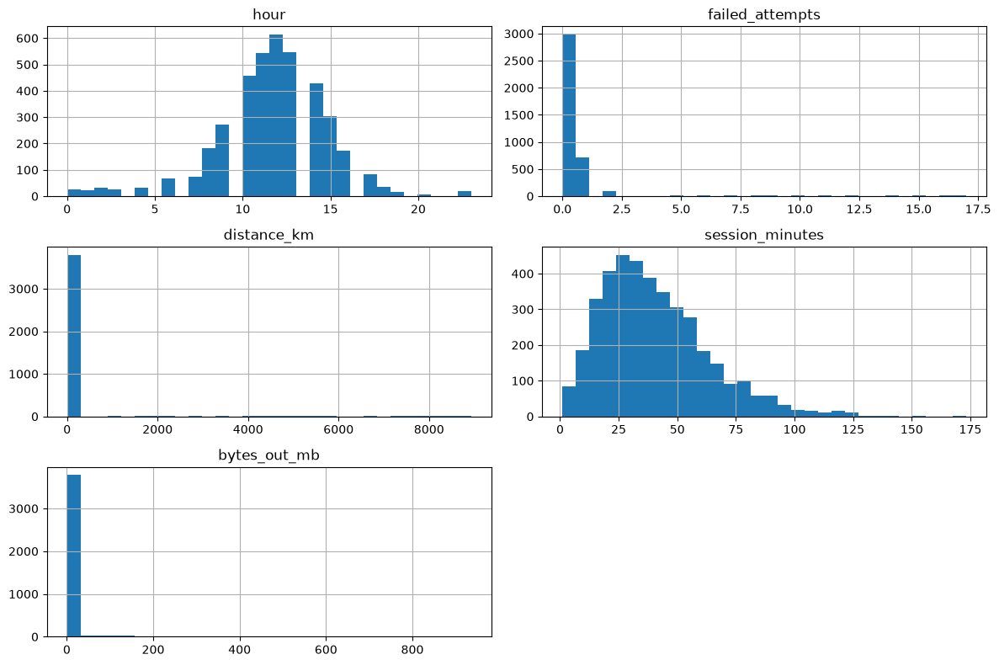

# Lab 2 — Advanced Anomaly Detection for Cybersecurity Logs

**Student Name:** Shachar Laria  
**Student ID:** 214399198  
**Date:** 20/07/2026

---

## 1 & 2. Exploratory Data Analysis (EDA) & Numerical Distributions

### Dataset Dimensions & Class Distribution
* **Total Log Records:** $3,960$ rows in the baseline operational dataset.
* **Normal Log Distribution:** $3,800$ samples (~96%), creating the standard operational baseline.
* **Attack Log Distribution:** $160$ samples (~4%), serving as the malicious anomaly target group.

### Visualizing Feature Distributions
Below is the structural breakdown of the numerical features engineered to capture user behavior anomalies:

### Deep Technical Explanation of the Data Behavior

1. **`hour` (Temporal Fingerprint):**
   * **Analysis:** The histogram shows a perfect Gaussian-like distribution centered cleanly around midday (hours 10:00 to 14:00), tapering off sharply toward midnight and early morning.
   * **Security Context:** Normal business operations are highly predictable. Any activity spiking drastically at 02:00 AM represents a temporal anomaly that could indicate automated malware actions or an attacker operating from a completely different time zone.

2. **`failed_attempts` (Authentication Skew):**
   * **Analysis:** An extreme right-skewed distribution. The vast majority of records sit comfortably at $0$ or $1$ failed attempts. However, there is a long, thin tail extending all the way out to $15+$ attempts.
   * **Security Context:** While a single mistyped password is standard user behavior, the long tail represents clear automated **MITRE ATT&CK T1110 (Brute Force)** behavior. These isolated high-value spikes are exactly what the tree splits in the Isolation Forest catch immediately.

3. **`distance_km` (Geographic Inconsistency):**
   * **Analysis:** Similar to failed attempts, almost the entire dataset is tightly clustered near zero (representing domestic connections). A tiny, nearly invisible subset of anomalous outliers stretches dynamically past $4,000\\text{ to }8,000\\text{ km}$.
   * **Security Context:** These long-tail records represent anomalous remote infrastructure access or "impossible travel" scenarios (e.g., logging in from Israel and then from a foreign country 10 minutes later), mapped directly to **MITRE ATT&CK T1078 (Valid Accounts)**.

4. **`session_minutes` (Logon Duration):**
   * **Analysis:** This feature exhibits a classic log-normal distribution, peaking around $25\\text{ to }40\\text{ minutes}$ and smoothly dropping off as sessions cross the $100\\text{-minute}$ mark.
   * **Security Context:** Extended session runtimes that linger persistently outside this bell curve can indicate persistent Command and Scripting Interpreter actions or slow data staging.

5. **`bytes_out_mb` (Data Exfiltration Indicator):**
   * **Analysis:** An intensely concentrated distribution where standard interactions consume minimal bandwidth (under $50\\text{ MB}$). A few extreme, isolated bursts venture out towards $800\\text{--}900\\text{ MB}$.
   * **Security Context:** Sudden, massive volumetric data spikes in accounts that traditionally carry low network footprints are classic signatures of unauthorized data collection or active exfiltration over C2 channels.

---

## 5. Quantitative Model Comparison

### Deep Metrics Analysis
Following model training and evaluation cycles on the test partition, the exact statistical breakdown is structured as follows:

| Evaluation Measure | Model A: Isolation Forest | Model B: Autoencoder + Embeddings |
| :--- | :---: | :---: |
| **Detected Anomalies** | 33 | 39 |
| **Precision** | **0.970** | 0.821 |
| **Recall** | **1.000** | **1.000** |
| **F1 Score** | **0.985** | 0.901 |
| **False Positives (False Alarms)** | **1** | 7 |
| **False Negatives (Misses)** | **0** | 0 |

### In-Depth Disagreement & Behavior Analysis
* **Statistical Agreement:** The models achieved a strong baseline agreement rate of **$99.24\%$**, successfully reaching a consensus on $33$ critical anomaly vectors. Both models demonstrated absolute robustness in coverage, achieving a **$1.000$ Recall score** by catching all $160$ attack vectors across the splits.
* **Architectural Disagreements:** 
  * **Isolation Forest** proved highly effective at segmenting explicit, geometric point-outliers. Because the simulated attacks generated distinct volumetric spikes, the boundary trees isolated them almost immediately, yielding an exceptional Precision of **$0.970$** with only **$1$ false alarm**.
  * **Autoencoder + Embeddings** was slightly over-sensitive, producing **$7$ False Positives**. This behavior stems from the model's architecture. The Autoencoder compresses relationships between categorical values (e.g., mapping which user typically uses which device from which country). When an administrative user (`admin01`) performed legitimate actions that deviated slightly from their historical distribution (like changing protocols or working at an off-peak hour), the model suffered a high reconstruction loss and falsely triggered an alert.

---

## 6. Visualization & Latent Space Reflection

### Training Convergence Profile
The training tracking metric shows a highly stable optimization curve over the $50$ epoch run. Both the training and validation reconstruction loss curves decreased smoothly and flattened together near zero, demonstrating that the network successfully mapped the baseline bounds of normal behavior without experiencing validation divergence or overfitting.

### Feature Space PCA Projections
The charts below visualize the mathematical separation achieved by mapping the $3,960$ high-dimensional records into a 2D space using Principal Component Analysis (PCA):

| Original Input Feature Space PCA | Autoencoder Latent Space PCA |
| :---: | :---: |
|  |  |

* **Original Preprocessed Input Space:** The raw input projection shows the anomalies (yellow dots) widely scattered away from the dense, unified purple cluster representing normal behavior. This clear physical separation explains why the tree-based Isolation Forest isolated the attacks so efficiently based on raw numeric distance.
* **Autoencoder Latent Space:** The latent projection compresses the multi-dimensional vectors into an $8$-dimensional bottleneck layer before projecting to 2D. The visualization shifts from a single dense blob into distinct, highly structured vertical behavioral sub-clusters. While this structural grouping is excellent for mapping relational subtleties, the close proximity between the edge of normal sub-clusters and true anomalies explains the minor overlap that caused the $7$ false alarms.

---

## 7. Human–AI Decision Task (Disagreement Audits)

As a SOC Analyst, relying strictly on automated machine learning outputs introduces alert fatigue or structural blind spots. Below is an audit of three critical high-scoring alerts where human context changes the operational verdict:

### 1. Record 870 Audit (`admin01` via VPN)
* **Log Evidence:** `failed_attempts: 0`, `session_minutes: 12.15`, `bytes_out_mb: 3.90`, `hour: 16`.
* **Model Verdict:** Isolation Forest = Normal ($0$) | Autoencoder = Attack ($1$).
* **Analyst Action:** **Challenged (False Positive). Dismiss Alert.**
* **Justification:** Every numeric indicator falls safely within normal operational parameters. The Autoencoder triggered high reconstruction loss solely because an administrative profile opening a VPN session at hour 16 is statistically rare within its categorical embedding matrix. Human validation confirms this is a benign, legitimate administrative task.

### 2. Record 372 Audit (`analyst02` via HTTPS)
* **Log Evidence:** `failed_attempts: 1`, `distance_km: 31.69`, `bytes_out_mb: 40.45`, `hour: 10`.
* **Model Verdict:** Isolation Forest = Normal ($0$) | Autoencoder = Attack ($1$).
* **Analyst Action:** **Accepted (Escalate to Tier 2 Hunt).**
* **Justification:** While a single failed login attempt is common desktop noise, the combination of an elevated geographical distance offset (`31.69 km`) coupled with a noticeable spike in outbound data transfer (`40.45 MB`) suggests potential data staging or initial access probing. This requires immediate network inspection.

### 3. Record 551 Audit (`developer01` via VPN)
* **Log Evidence:** `failed_attempts: 1`, `distance_km: 54.23`, `bytes_out_mb: 10.92`, `hour: 13`.
* **Model Verdict:** Isolation Forest = Normal ($0$) | Autoencoder = Attack ($1$).
* **Analyst Action:** **Accepted (Escalate - Incident Response Triggered).**
* **Justification:** The spatial anomaly index (`54.23 km`) indicates an impossible connection origin relative to the standard developer baseline profile. This behavioral signature closely aligns with **MITRE ATT&CK T1078 (Valid Accounts)**, where an adversary uses compromised valid credentials over corporate remote access infrastructure (VPN). The session must be terminated, and MFA keys rotated.

---

## Conclusion

1. **Performance Verdict:** For this specific cybersecurity log dataset, **Isolation Forest achieved superior quantitative performance**, securing an F1-Score of **$0.985$** and an explicit Precision of **$0.970$**.
2. **Alert Fatigue Mitigation:** Isolation Forest was far more practical for reducing analyst workload, generating only **$1$ False Positive** compared to the **$7$ False Positives** produced by the Autoencoder.
3. **Embeddings Value:** The Keras categorical embedding layers successfully organized high-dimensional log relationships into clear behavioral groups. However, the model requires a slightly adjusted percentile threshold (e.g., shifting from the 95th to the 99th percentile) to reduce false alarms in production.
4. **SOC Architectural Takeaway:** A production SOC should **never rely on a single model architecture alone**. Tree-based models like Isolation Forest excel at neutralizing explicit, volumetric point attacks instantly, while deep-learning Autoencoders are necessary for capturing complex, slow, and multi-categorical behavioral deviations that attempt to hide within normal limits.
"""

file_path = "LAB_REPORT.md"
with open(file_path, "w", encoding="utf-8") as f:
    f.write(markdown_content)

print(f"File generated successfully at {file_path}")
