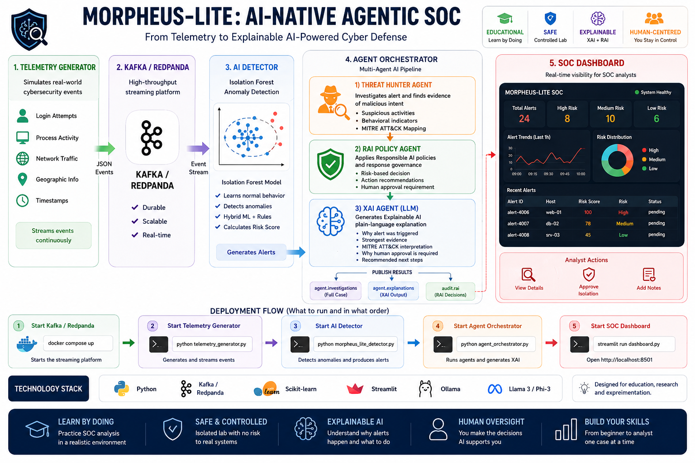

# Morpheus Lite Laboratory v1.0

Morpheus Lite Laboratory is a stable, governance-aware, AI-native Security Operations Center (SOC) environment for cybersecurity education and human-AI collaboration research.

The laboratory lets students follow a complete workflow:

```text
Telemetry -> Redpanda/Kafka -> AI detection -> Threat investigation
          -> Responsible AI policy -> Explainable AI -> Meta-AI review
          -> Human decision -> Audit and research export
```

> Morpheus Lite Laboratory is an educational and research system. It must not be used to monitor or control production infrastructure.



## Laboratory learning goals

Students learn to:

- interpret cybersecurity telemetry and anomaly alerts;
- distinguish model output from supporting evidence;
- examine an AI-generated explanation critically;
- apply Responsible AI policy constraints;
- make and justify a human decision;
- trace one case across agents and Kafka topics;
- reflect on human oversight, Meta-AI skills, and decision sovereignty.

## Stable laboratory scope

The v1.0 baseline includes:

- synthetic telemetry generation;
- Redpanda/Kafka event streaming;
- Isolation Forest and rule-based detection;
- behavioral fingerprinting;
- Threat Hunter investigation logic;
- Responsible AI policy decisions;
- deterministic, Ollama, NVIDIA NIM, ONNX Runtime, and Triton inference adapters;
- resilient fallback inference;
- XAI explanations;
- Meta-AI supervisory review;
- synchronized dashboard navigation using `alert_id`;
- human decisions and written justifications;
- JSONL audit logging and optional Parquet export;
- Prometheus-compatible metrics;
- automated unit tests.

## Quick start

### 1. Create the environment

```bash
python -m venv .venv
```

Windows PowerShell:

```powershell
.venv\Scripts\Activate.ps1
python -m pip install --upgrade pip
pip install -e ".[research,dev]"
```

Linux or macOS:

```bash
source .venv/bin/activate
python -m pip install --upgrade pip
pip install -e ".[research,dev]"
```

### 2. Validate the installation

```bash
pytest -q
```

### 3. Run the laboratory

Use a separate terminal for each Python service.

```bash
# Terminal 1
docker compose up -d redpanda console

# Terminal 2
python telemetry_generator.py

# Terminal 3
python morpheus_lite_detector.py

# Terminal 4
python agent_orchestrator.py

# Terminal 5
streamlit run dashboard.py
```

Open:

- Dashboard: `http://localhost:8501`
- Redpanda Console: `http://localhost:8080`

In the dashboard, select **Fetch new cases from Kafka**.

## Student workflow

1. Select an alert in **All Cases**.
2. Confirm that the same `alert_id` appears as the active alert and in **Case Details**.
3. Read the XAI explanation and supporting evidence.
4. Review the RAI decision and Meta-AI assessment.
5. Choose a human decision.
6. Write an evidence-based justification.
7. Record the decision.
8. Verify the decision in `human.decisions` and `data/audit.jsonl`.
9. Export the research data.

The full procedure is in [Student Laboratory Guide](docs/STUDENT_LABORATORY_GUIDE.md).

## Core identifiers

- `alert_id`: primary dashboard and case identifier.
- `correlation_id`: backend trace identifier across Kafka topics and agents.

All dashboard panels are synchronized through `st.session_state.selected_alert_id`.

## Kafka topics

| Topic | Purpose |
|---|---|
| `raw.logs` | Synthetic telemetry |
| `morpheus.alerts` | Detector alerts |
| `agent.investigations` | Complete cases shown in the dashboard |
| `agent.explanations` | XAI outputs |
| `audit.rai` | RAI policy records |
| `agent.meta_ai` | Meta-AI reviews |
| `human.decisions` | Analyst decisions and justifications |
| `soc.alerts` | Optional SOC-facing output |
| `reflection.events` | Optional learning reflections |
| `dead.letter.events` | Failed processing records |

## Inference providers

The default provider is set in `config/settings.yaml`. Override it with an environment variable:

Windows:

```powershell
$env:MORPHEUS_INFERENCE_PROVIDER="deterministic"
```

Linux or macOS:

```bash
export MORPHEUS_INFERENCE_PROVIDER=deterministic
```

Supported values:

- `deterministic`
- `ollama`
- `nim`
- `onnx`
- `triton`

The deterministic provider is recommended for classroom reproducibility.

## Research export

```bash
python export_research_data.py
```

Generated research records may include alert identifiers, model and agent outputs, RAI decisions, Meta-AI dispositions, human decisions, justifications, risk scores, timestamps, and provider metadata.

## Documentation

- [Architecture](docs/ARCHITECTURE.md)
- [Student Laboratory Guide](docs/STUDENT_LABORATORY_GUIDE.md)
- [Instructor Quick Start](docs/INSTRUCTOR_QUICK_START.md)
- [Laboratory Release Manifest](docs/LABORATORY_RELEASE.md)
- [Research Data Guide](docs/RESEARCH_DATA_GUIDE.md)
- [Troubleshooting](docs/TROUBLESHOOTING.md)
- [Migration Guide](MIGRATION_GUIDE.md)
- [Version History](VERSION_HISTORY.md)

## Freeze policy

Morpheus Lite Laboratory v1.0 is the stable teaching baseline. Changes to this release should be limited to critical bug fixes, security corrections, installation fixes, and documentation corrections that do not break the frozen event and research schemas. New features should be developed in a later version or branch.
